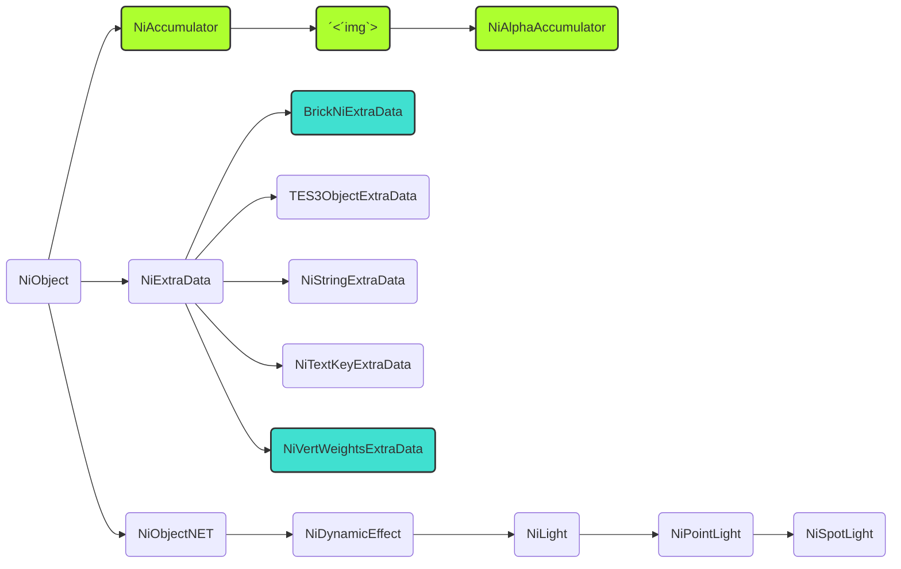

## Hi there 👋

```mermaid
graph LR
A(NiObject) --> B(NiAccumulator);
B --> C(´<´img`>);
C --> D(NiAlphaAccumulator);
A --> E(NiExtraData);
E --> F(BrickNiExtraData);
E --> G(TES3ObjectExtraData);
E --> H(NiStringExtraData);
E --> I(NiTextKeyExtraData);
E --> J(NiVertWeightsExtraData);
A --> K(NiObjectNET);
K --> L(NiDynamicEffect);
L --> M(NiLight);
M --> N(NiPointLight);
N --> O(NiSpotLight);
classDef notExposed fill:#ADFF2F,stroke:#333,stroke-width:2px;
class B,C,D notExposed;
classDef notResearched fill:#40E0D0,stroke:#333,stroke-width:2px;
class F,J notResearched;
```
